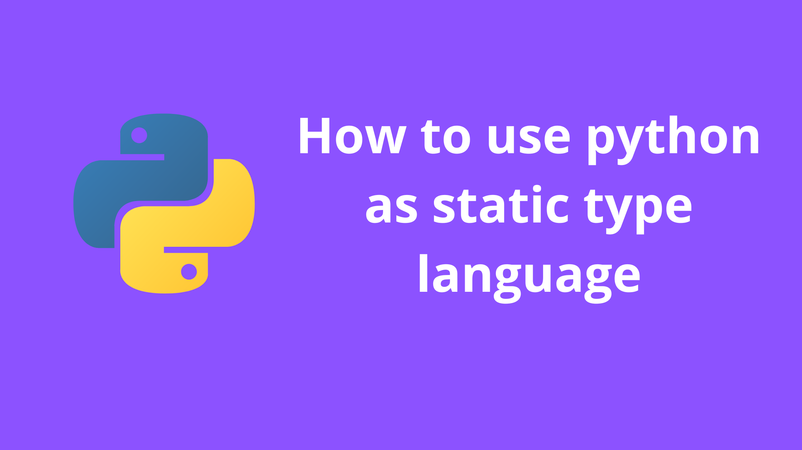
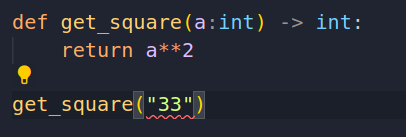

# Why Type check Python
**Why use static typing?**: Static type languages can catch type-related errors at compile-time, resulting in safer and more efficient code, but may require more upfront work.

<!-- truncate -->



## How to use?
We can use `mypy` to type check. Add this in your vscode settings file to get started with typechecking.

## First install mypy

```bash
pip3 install mypy
```

## How to enable typechecking in vscode
Add this settings in your vscode to enable typechecking

```json
{
    "python.analysis.typeCheckingMode": "strict",
    "python.linting.mypyEnabled": true,
}
```

Then error will shown directly on vscode



## Normal types

```python
from typing import Union, Optional, List, TypeVar

a: int = 3
b: str = "33"
c: Union[int, str] = "32"
d: Optional[int] = None
e: List[str] = ["hello", "33"]

# general type
strOrInt =  TypeVar("strOrInt", str, int)

def get_sum(a: strOrInt, b: strOrInt) -> strOrInt:
    return a + b
```

## Interface like syntax

```python
from typing_extensions import Protocol

class Renderable(Protocol):
    def render(self) -> str: ...

def render(obj: Renderable) -> str:
    return obj.render()

class Foo:
    def render(self) -> str:
        return "Foo!"

render(Foo())
```

## How to avoid typing for some particular case like legacy code etc

```python
#1: use Any
def func(a:str) -> Any:
		return something(a)

#2: cast
p: Any =  33

def fun(p:int) -> int:
    return p + 1
# any will not throw error, but this is just an example
fun(cast(int, p))

#3 ignore
func("hdll") # type: ignore
```