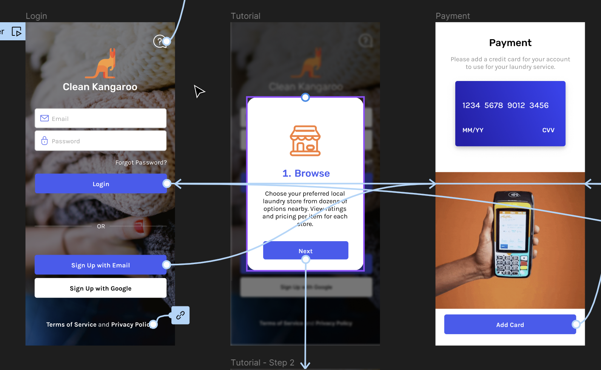
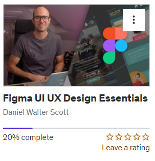
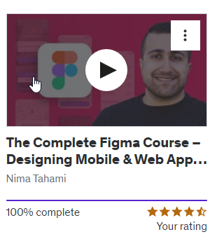

# Why I learned Figma as a programmer

Before you know why I learned Figma as a programmer, let me tell you something about me and my background.

<!-- truncate -->

## My background

Hi, my name is Sandip Sadhukhan, and I am currently doing a full time job as a software engineer. Now, I am also enthusiastic about solving real life problem using [SAAS(Software as a service)](https://en.wikipedia.org/wiki/Software_as_a_service).

## What is Prototype and why its needed?

So, as a developer we get design from product manager or UI/UX designer and we do the code part. But when you start your solopreneur journey then you need to put multiple hats. You are the product manager now who talks with customer, you are the developer who develop the program and you are the social media manager who handle social media and ads.

Now, as a developer for our side projects we mostly ignore this prototyping process, we either directly wrote the software from idea in our brain or we do basic [wireframing](https://en.wikipedia.org/wiki/Website_wireframe) with pen and paper and we start coding.

Now, when you are creating a SAAS, it is important that before starting the coding you are discussing your solution to some clients. It will assure that your solution is actually helping them to solve the main problem so it didn’t help them.

Now, you can’t show a pen & paper prototype to a real client. You can do, but that will not very professional or if your clients are not aware of these type of software then it will create confusion or you have to explain a lot.

One more reason to have prototype is to show them how your [MVP](https://en.wikipedia.org/wiki/Minimum_viable_product)(Minimal viable product) will look like. It is important to show this to customer to sell before you launching your software.

Last but not the least, if you need any VC or investor to invest in your software then also you need some kind of prototype when you didn’t build the real software.

## Ok, but why Figma?

Peoples may have different opinion about their best designing software, which is fine. If you have already some knowledge about some software or you like it, then start continuing it. But, if you don’t have knowledge about any designing software, or you want to try a new design software then I will recommend to use Figma.

Mainly because of it’s easy learning curve. As a developer, I feel much easer to learn Figma. Plus it has many tools like auto-layout, components, variants, prototyping tool etc which helps to design fast.

## How I learned Figma?

First I started taking a Udemy course its called [Figma UI UX Design Essentials](https://www.udemy.com/course/figma-ux-ui-design-user-experience-tutorial-course/), but I didn’t like it really, I started but later found that, it is may be good for designer who wants to learn in depth like icon design, low-fidelity , high-fidelity design etc. But it is not good for solopreneur. Because it didn’t cover practical scenario. I didn’t said it is bad at all, but is not fit for my case. The length of the course is 11.5 hours.

Later I found out this course on udemy [The Complete Figma Course – Designing Mobile & Web App UI/UX](https://www.udemy.com/course/the-complete-figma-course/). And I liked it, it actually give me the practical knowledge which I exactly want.

Because, it didn’t start with some kind of boring lecture. It start with to the point how to make a design from pen & paper design and how to add prototype, animation, overlay. How to add components, variants etc. And it teaches all the knowledge in 6.5hours only.

## Conclusion & my next steps

At the end, I learn a lot about mobile design and web design. And my next steps will be to learn about design principals and usability. I will tell more in next blog when I actually done it.
